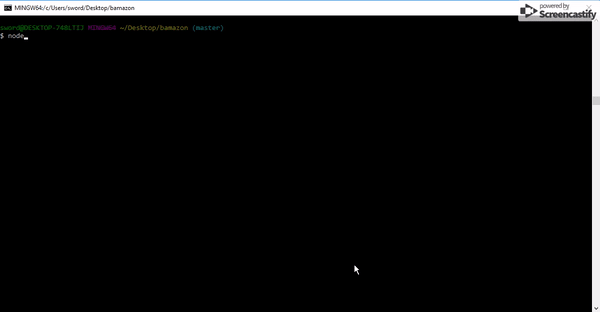
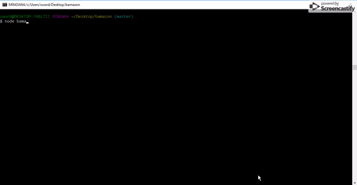

# Bamazon
Find everything you need at Bamazon! Bamazon, the node cli shopping app.

## Getting started
My Bamazon program consits of two parts. 
* The customer part, where you can view and buy items. 
* The manager part, where you can view items, add to stock, and add new items.

Bamazon is dependent on 3 node packages.
1. [Inquirer](https://github.com/SBoudrias/Inquirer.js/)
2. [MySql](https://www.npmjs.com/package/mysql)
3. [CLI Table](https://www.npmjs.com/package/cli-table)

After you clone down the repository, just run 
```
npm install
```
as the packages are included in the dependencies in the package.json file.

## Using the program
First you need to create a database in MySql with the code provided in bamazon.sql. Then you can run the following commands.

Customer version
```
node bamazonCustomer.js
```



Manager version
```
node bamazonManager.js
```


## Creating Bamazon
### Customer

The customer version only has two options, buy or quit. The table is the main part of this version.

This is the code to display the table. We create a new Table with the CLI Table package. We connect to the MySql database and add all the data to the table. Then we bring the menu back up.
``` js
function display() {
    connection.query('SELECT * FROM products', function (err, res) {
        var table = new Table({
            head: ['Item ID', 'Product Name', 'Department', 'Price', 'Stock']
        });

        for (var i = 0; i < res.length; i++) {
            table.push([res[i].item_id, res[i].product_name, res[i].department_name, res[i].price, res[i].stock_quantity]);
        }
        console.log(table.toString());
        customer();
    })
}
```
The customer can choose a product by their id and then purchase an amount that is within the stock limmit.
``` js
function buyItem(id, amount) {
    var query = "SELECT * FROM products WHERE ?";
    connection.query(query, [{
        item_id: id
    }], function (err, res) {
        if (err) throw err;
        var item = res[0];
        var stock = item.stock_quantity;
        if (item.stock_quantity >= amount) {
            var query = "UPDATE products SET ? WHERE ?";
            connection.query(query, [{
                    stock_quantity: stock - amount
                },
                {
                    item_id: id
                }
            ], function (err, res) {
                if (err) throw err;
                console.log(`You have successfully purchased ${amount} ${item.product_name} for $${item.price * amount}.`);
                display();
            })
        } else {
            console.log("Invalid quantity!");
            display();
        }
    })
}
```
### Manager
The manager has more options including: 
1. View products for sale
2. View products with low inventory
3. Add to inventory
4. Add new product

We control the commands with a switch case like so:
``` js
function commands() {
    inquirer.prompt([{
        type: 'list',
        message: 'What would you like to do?',
        name: 'command',
        choices: ['View products for sale', 'View low inventory', 'Add to inventory', 'Add new product', 'Quit']
    }]).then(function (res) {
        switch (res.command) {
            case 'View products for sale':
                display();
                break;
            case 'View low inventory':
                low();
                break;
            case 'Add to inventory':
                addAmount();
                break;
            case 'Add new product':
                addProduct();
                break;
            case 'Quit':
                process.exit(-1);
        }
    })
}
```
The functions themselves are similar in format but have very different functions. The format is inquirer to ask questions, then connection.query to make changes based on the answers to the questions.

Here we have the addProduct() function:
``` js 
function addProduct() {
    inquirer.prompt([{
            type: 'input',
            message: "What is the name of the item?",
            name: "name"
        },
        {
            type: "input",
            message: "What is the department name?",
            name: "department"
        },
        {
            type: "input",
            message: "What is the price?",
            name: "price",
            validate: function (input) {
                if (isNaN(input) === false) {
                    return true;
                } else if (isNaN(input) === true) {
                    console.log('\nYou need to provide a number');
                    return false;
                }
            }
        },
        {
            type: "input",
            message: "How many are you going to stock?",
            name: "stock",
            validate: function (input) {
                if (isNaN(input) === false) {
                    return true;
                } else if (isNaN(input) === true) {
                    console.log('\nYou need to provide a number');
                    return false;
                }
            }
        }
    ]).then(function (response) {
        var values = { product_name: response.name, department_name: response.department, price: response.price, stock_quantity: response.stock };
        connection.query("INSERT INTO products SET ?", values, function (err, res) {
            if (err) throw err;
            display();
        });
    })
}
```
It first asks the manager for product information, then adds that information into MySql, then we display all products again to show the updated list.

## Learning Points
The goal of this project was to learn how to create, read, update, and delete (CRUD) from a MySql datababse. We are also practicing our node/node packages skills with the 3 that we use in this project. The main issue I ran into was the syntax for MySql. The logic itself is not difficult as you just want to update a value at a specific location. The syntax is very specific, so you have to get everything correct or else you get an error. This was very cool to create, especially seeing the nicely formatted table.

## Author
My GitHub - 
[Bryan Liang](https://github.com/liangbryan2)
